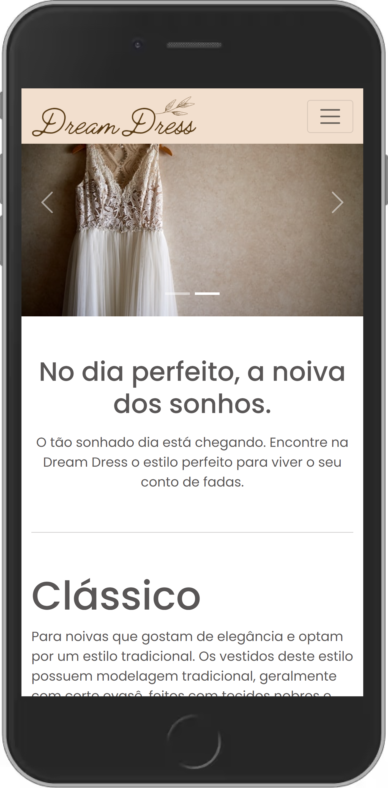
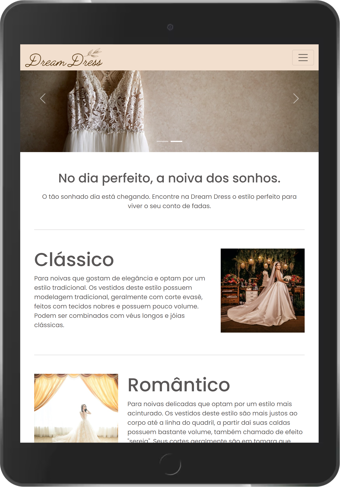

<h1 align="center">Dream Dress</h1>

# O projeto
Landing Page responsiva de apresentação para uma loja fictícia sobre estilos vestidos de noiva.

# Tecnologias utilizadas
- HTML
- CSS
- Bootstrap v5.1

# Como executar
```bash
- Utilizando o terminal:

  # Clone o repositório: 
  $ git clone https://github.com/HeloiseSantos/dream-dress.git

  # Abra o projeto em uma IDE (Preferencialmente no Visual Studio Code para utilizar a extensão abaixo)
  
  # Utilize a extensão Live Server para abrir um server local e visualizar a tela do projeto
  https://marketplace.visualstudio.com/items?itemName=ritwickdey.LiveServer
```

# Layout do projeto
<div align="center">
    
    
    
</div>

# Créditos
- Imagens obtidas em: https://unsplash.com/s/photos/wedding-dress
- ícones obtidos em: https://feathericons.com/
- Logo criada em: https://www.canva.com/pt_br/
